[<- Chapter 1 – Getting things ready: Sign-up/sign-in to Azure and AzureML Studio](./01-Sign-up.md)

# Chapter 2 - Create project and import data

The first thing that we&#39;ll need for our experiment is the data that we will use for both train/test our model and to generate predictions with our trained model. Using Azure ML Studio tool we can import our data in multiple ways (directly from SQL databases, DocumentDB, Azure Storage...and other storage options, using the &quot;Import Data&quot; module on the tool), but let&#39;s keep thing simple and upload three csv files to our Azure ML account:

1. leagues\_NBA\_totals\_master: file containing the total stats (points, assists, rebounds, steals, games played, minutes, etc.) for every NBA player since 1981 to 2016, which will be used to train and evaluate our model -&gt; C:/Lab/leagues\_NBA\_totals\_master.csv or download it [here](https://aka.ms/nba-totals-master-mlfordevs)
2. leagues\_NBA\_advanced\_master: file containing the advanced stats (PER, true shooting %, offensive win share, defensive win share, total win share, etc.) for every NBA player since 1981 to 2016, which will be used to train and evaluate our model -&gt; C:/Lab/leagues\_NBA\_advanced\_master.csv or download it [here](https://aka.ms/nba-advanced-master-mlfordevs)
3. nba\_2017\_players\_input: file containing the info for every player who played on the 2016-2017 NBA season (rookies included), which will be used to create the predictions -&gt; C:/Lab/nba\_2017\_players\_input.csv or download it [here](https://aka.ms/nba-2017-players-input)

Note that every csv file share 5 common field (Player, Pos, Age, Tm and Season), which will be the features we&#39;ll use for our experiment.

Once downloaded, let&#39;s upload our three files on out Azure ML workspace:

1. We start by switching the view to the &quot;Datasets&quot; tab, and clicking on the &quot;New&quot; button in the bottom left corner:
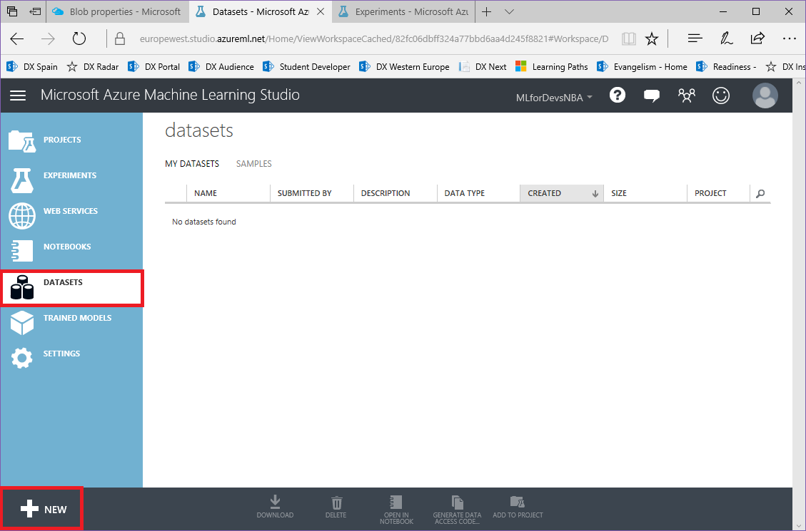

2. On the &quot;New&quot; blade, click on &quot;From local file&quot; and select the file to upload (repeat this step for each file):
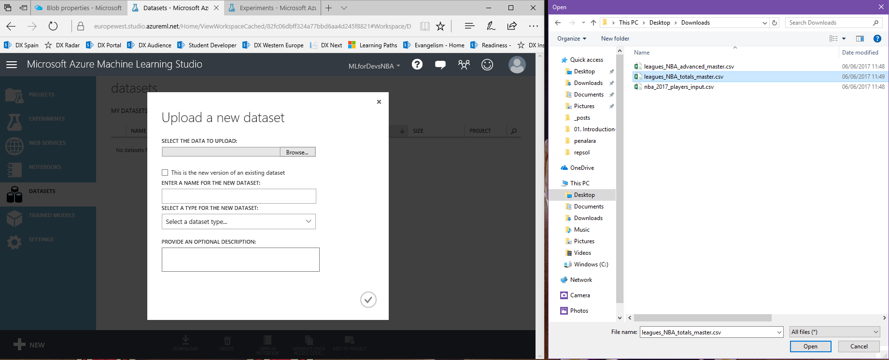

3. Once uploaded, we can find our three files on the &quot;Datasets&quot; list:

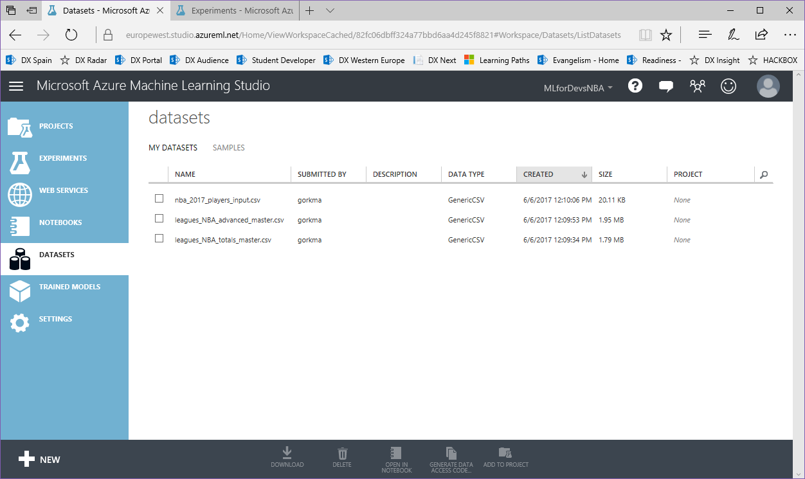

As you can see, there is an empty &quot;Project&quot; column. Projects allow us to organize our datasets, experiments and other components by putting them together on the same place. Let&#39;s create a new project to add our recently uploaded datasets and the experiments we are about to create.

1. Select the 3 csv files and click on the &quot;Add to project&quot; button on the bottom bar:
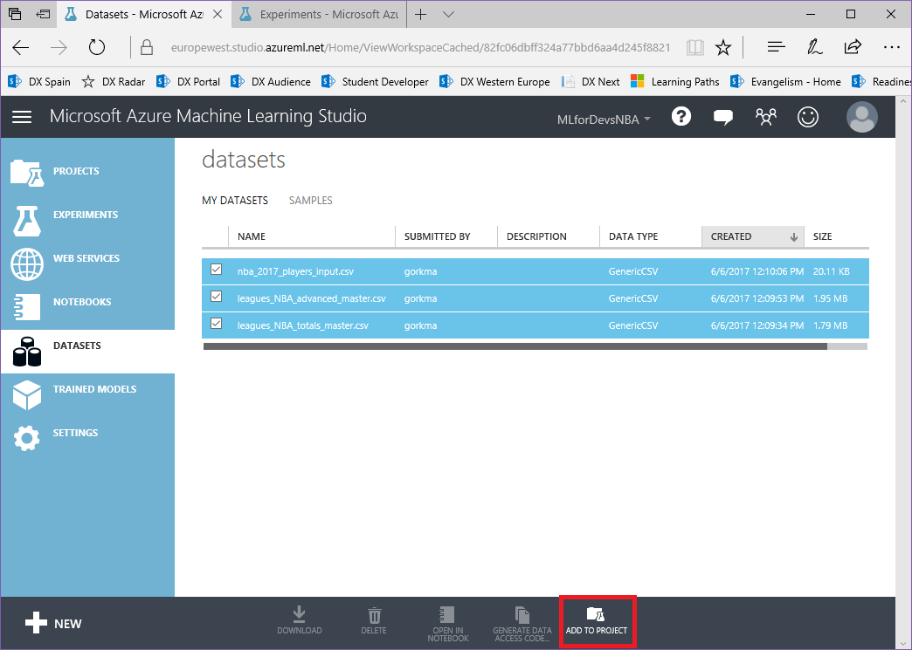

2. Click on &quot;New project&quot; and enter the desired name for your project:
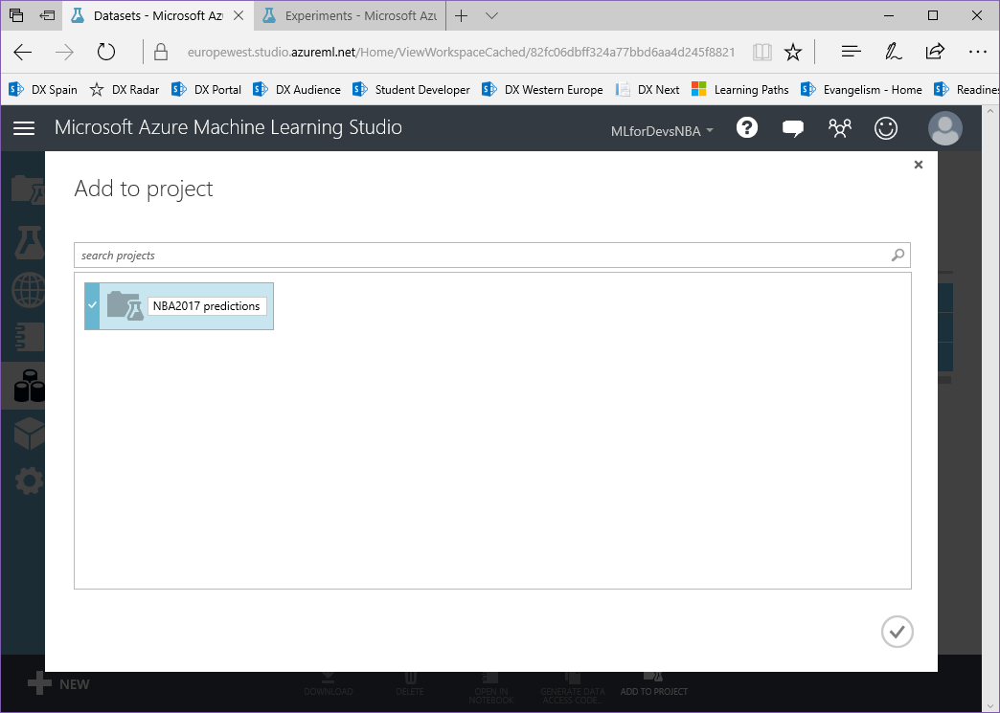

3. You can check that the project with our 3 datasets has been created by switching to the &quot;Projects&quot; view:
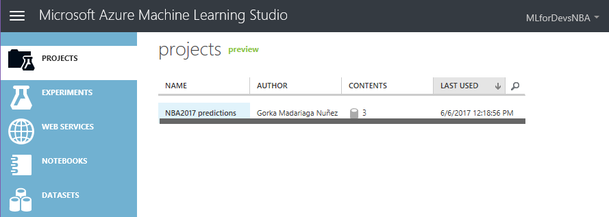

Now, let&#39;s create our first experiment, in which we will create the data flow to clean and prepare our data and also we&#39;ll train our model to generate the predictions for 2016-2017 season:

1. Switch to the &quot;Experiments&quot; view, and click on the &quot;New&quot; button on the bottom-left corner:
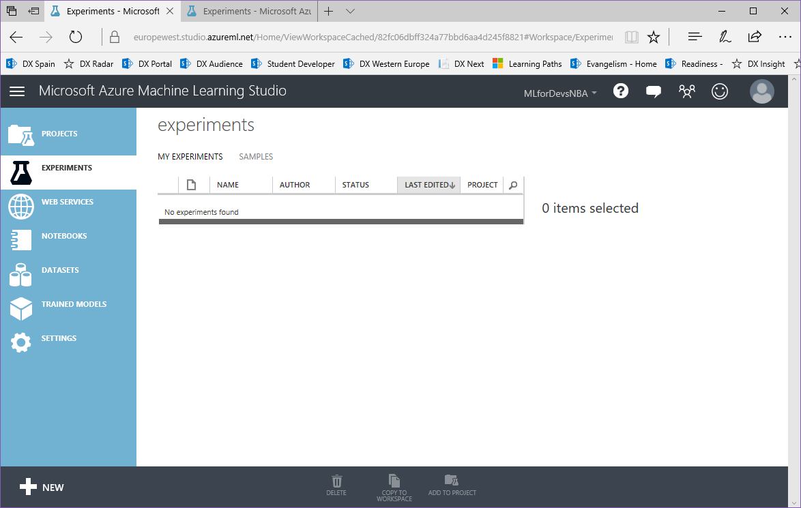

2. On the &quot;New&quot; blade, select &quot;Blank Experiment&quot; to continue:
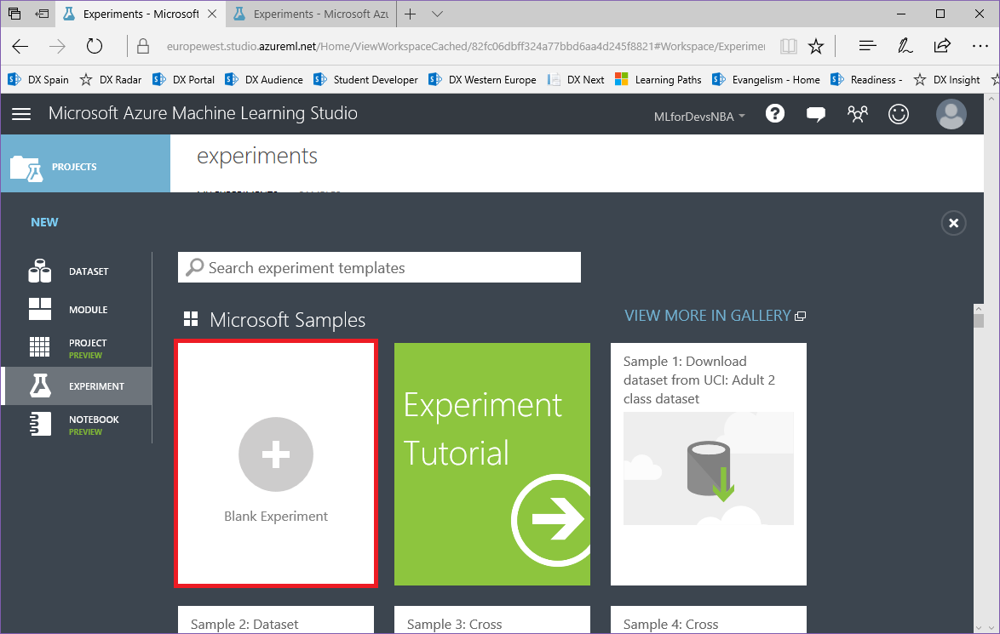

3. Once created, change the name of the experiment to one less generic:
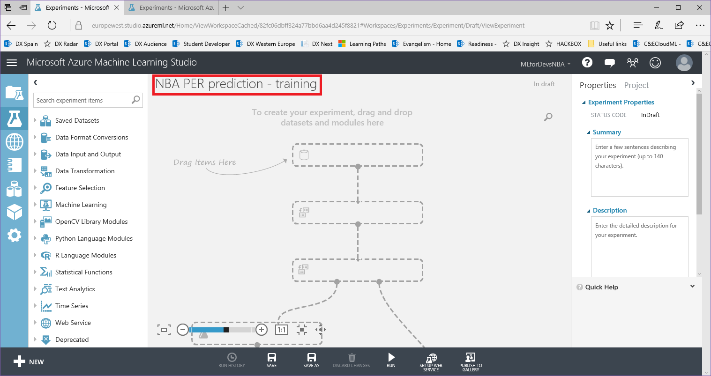

As we cannot save an experiment without any modules, let&#39;s start it by adding our training datasets and joining them using the fields they have in common:

1. On the left column of the tool, we have the list of the different modules that we can use on our experiments. Add the totals and advanced datasets by browsing &quot;Saved Datasets &gt; My Datasets&quot; and drag-and drop both files:
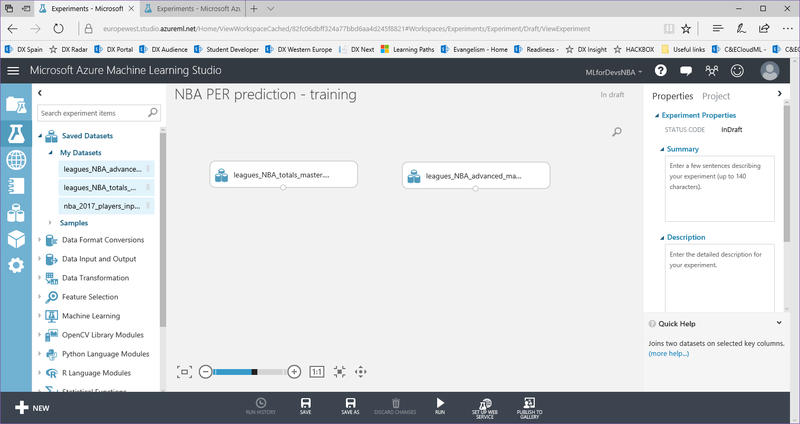

2. On the same left column, search for the &quot;Join Data&quot; module and drag it to the canvas. Once you&#39;ve done it, you&#39;ll need to connect both datasets with the &quot;Join Data&quot; module by dragging from the bottom dot of the dataset to the top on the &quot;Join Data&quot; module:
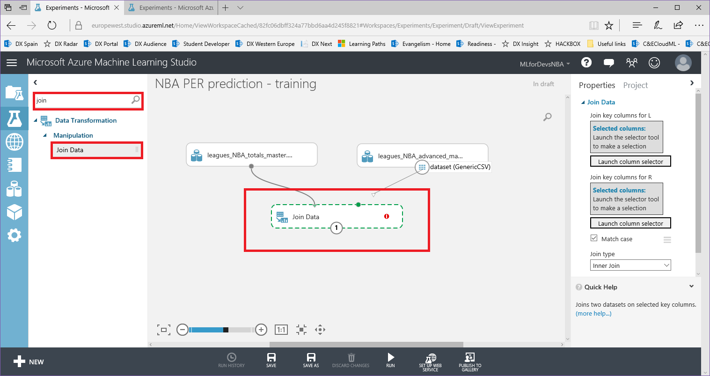

3. With the &quot;Join Data&quot; module selected, let&#39;s choose the common columns to joint both datasets. Click on the &quot;Launch column selector&quot; for the first dataset, select the common columns (Player, Post, Age, Tm, Season), click on the right arrow on the middle of both lists and click on the ok button on the bottom-right corner to confirm, then repeat it for the second dataset:
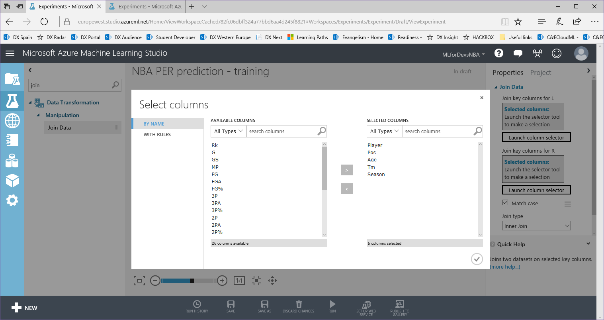

4. To complete this step, select the &quot;Inner Join&quot; type on the dropdown, and un-check the &quot;Keep right key columns in joined table&quot; to avoid duplicate columns on our joined dataset:
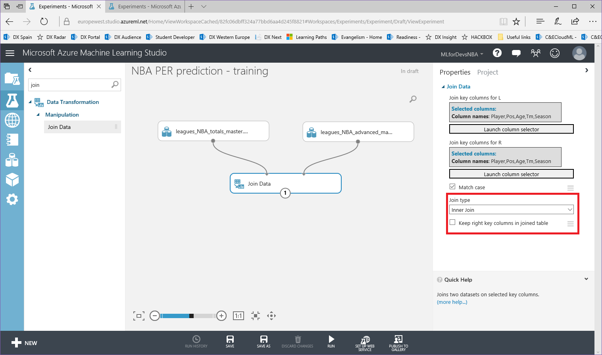

5. You can run the experiment and take a look at the resulting dataset by right clicking (when completed, a green check sign will appear on the Join Data module) on the &quot;Join Data&quot; bottom dot and &quot;Visualize&quot;:
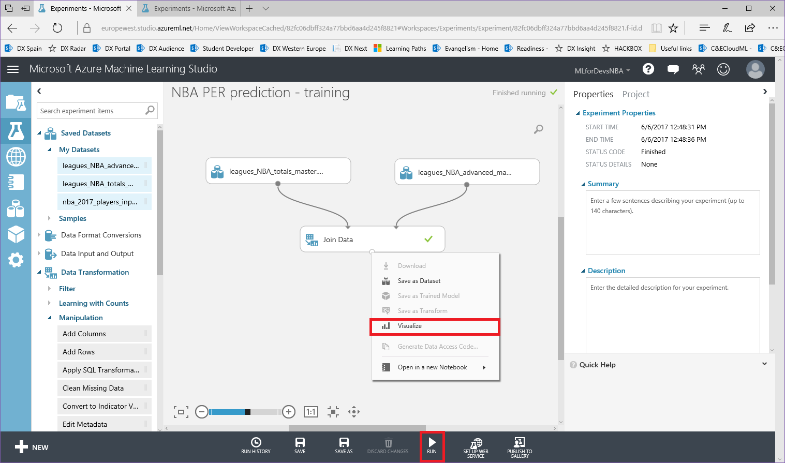

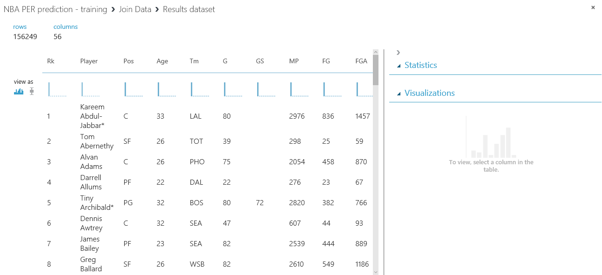

Finally, let&#39;s also add our experiment to the project we created before, so we have all of our assets together:

1. Save the experiment (bottom bar button), switch to the &quot;Projects&quot; view, click to the one you created before and click on the &quot;Edit&quot; button on the bottom bar:
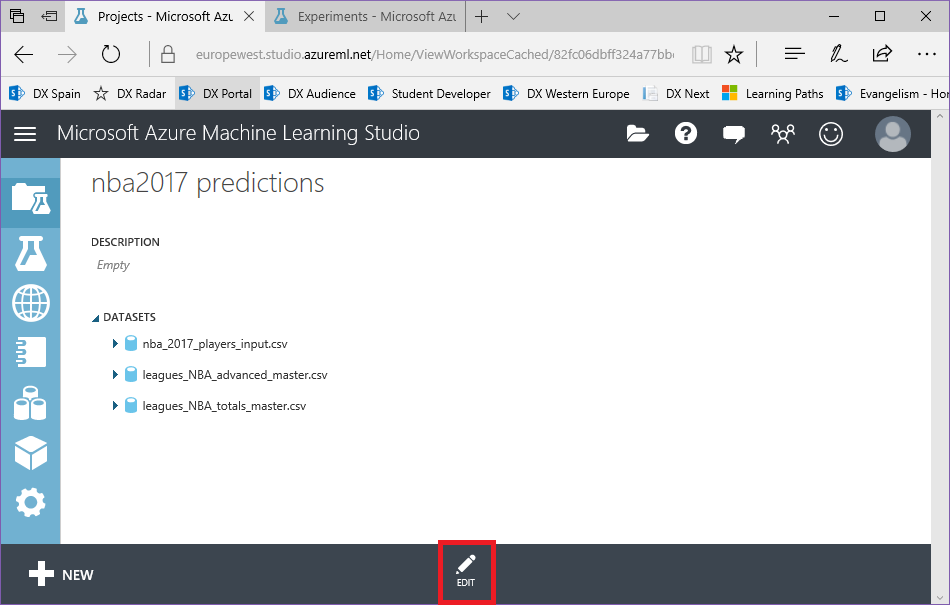

2. On the edit view, open the &quot;Experiments&quot; dropdown, mark the experiment you just created and click on the right arrow between both lists:
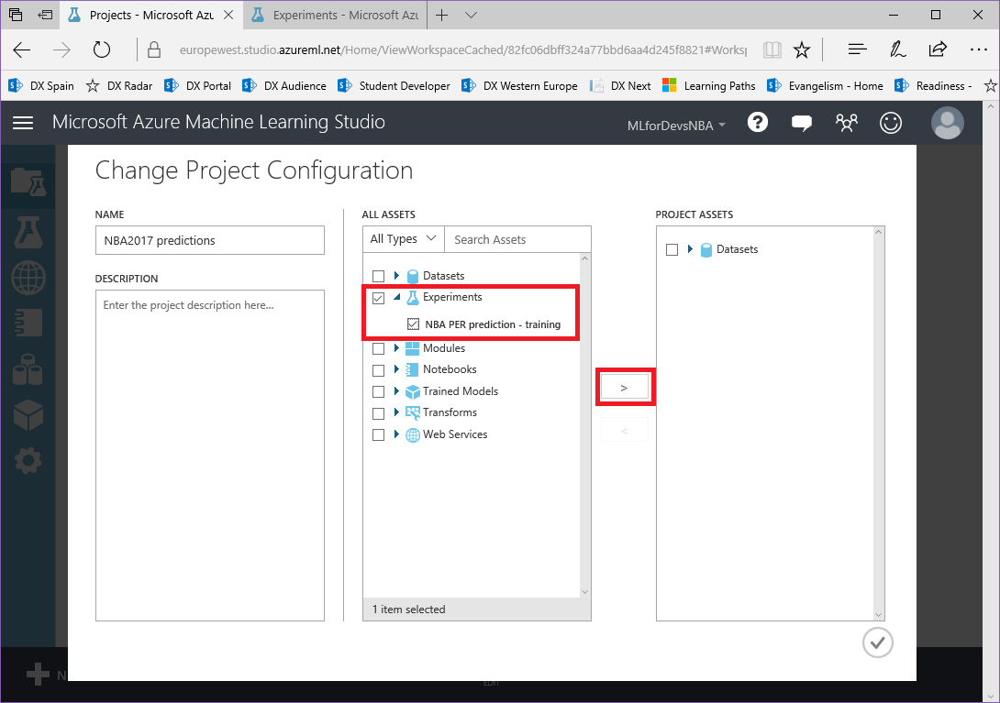

Now you are ready to go! You have your datasets, the training experiment with the first step on the dataflow and the project containing all of your assets, which should look like this:
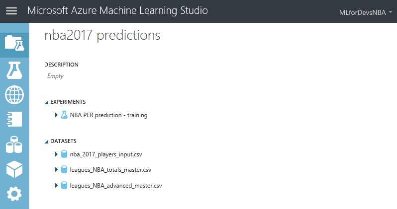

[-> Chapter 3 - Data prep & cleanse](./03-Data%20prep%20&%20cleanse.md)